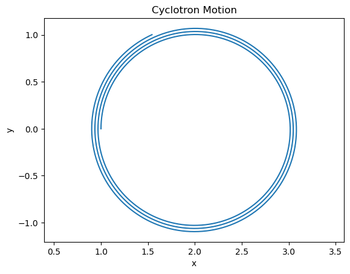

# Charged Particle Motion in Electromagnetic Fields

## Overview

This project simulates the motion of a charged particle in uniform electric and magnetic fields using the **velocity Verlet integration method**. The simulation numerically solves the classical equations of motion derived from the **Lorentz force law**, allowing one to study trajectories such as linear acceleration, circular motion, and helical motion depending on the applied fields.

The code is written in **Python** using **NumPy** and is designed to be modular, readable, and easily extensible to more general field configurations.

---

## Physics Background

The motion of a charged particle with charge \( q \) and mass \( m \) in electric and magnetic fields is governed by the **Lorentz force**:

F = q ( E + v × B )

Using Newton’s second law,

a = F / m = (q / m) ( E + v × B )

### Key Physical Behaviors

- **Electric field acceleration**  
  A uniform electric field accelerates the particle along the field direction.

- **Magnetic field deflection**  
  A uniform magnetic field produces circular motion perpendicular to the field due to the velocity-dependent cross product.

- **Helical trajectories**  
  When the velocity has components both parallel and perpendicular to the magnetic field, the resulting motion is helical.

---

## Numerical Method: Velocity Verlet Integration

The equations of motion are integrated using the **velocity Verlet method**, a second-order, time-reversible algorithm commonly used in computational physics.

### Advantages of Velocity Verlet

- Second-order accuracy in time
- Good energy conservation properties
- Widely used in plasma physics and molecular dynamics

### Update Scheme

**Position update:**

r_{n+1} = r_n + v_n Δt + (1/2) a_n Δt^2

**Acceleration update:**

The new acceleration is computed using the updated position and velocity-dependent fields.

**Velocity update:**

v_{n+1} = v_n + (1/2) (a_n + a_{n+1}) Δt

---

## Code Structure

### Field Definitions

    def electric_field(t, r):
        return np.array([E0, 0.0, 0.0])

    def magnetic_field(t, r):
        return np.array([0.0, 0.0, B0])

These functions define uniform electric and magnetic fields and are written to allow easy replacement with time- or position-dependent field configurations.

---

### Particle Class

    class Particle:
        def __init__(self, q, m, r0, v0):
            ...

Encapsulates particle properties (charge, mass, position, velocity) and computes the acceleration using the Lorentz force.

---

### Integrator

    velocity_verlet(particle, E_func, B_func, dt, t)

Performs a single integration step using the velocity Verlet algorithm.

---

### Simulation Driver

    run_simulation(particle, dt, t_max)

Runs the time evolution loop and stores position and velocity histories for analysis and visualization.

---
## Cyclotron Motion Example

As an illustrative example, we simulate a charged particle moving in a uniform magnetic field with no electric field. This is a classic scenario in plasma and accelerator physics, known as cyclotron motion.

### Physics Background

When a particle of charge q and mass m enters a uniform magnetic field B with velocity perpendicular to the field, the Lorentz force acts as a centripetal force:

    F = q * (v × B)

For a velocity perpendicular to B, this results in circular motion with:

- Cyclotron frequency: ω_c = q B / m
- Radius of the orbit: r_c = m v_perp / (q B)

### Simulation Code

    import matplotlib.pyplot as plt

    # Physical constants (normalized units)
    q = 1.0
    m = 1.0
    global E0, B0
    E0 = 0.0
    B0 = 1.0

    r0 = [1.0, 0.0, 0.0]
    v0 = [0.0, 1.0, 0.0]

    particle = Particle(q, m, r0, v0)

    dt = 0.01
    t_max = 20.0

    r, v = run_simulation(particle, dt, t_max)

    plt.plot(r[:,0], r[:,1])
    plt.xlabel("x")
    plt.ylabel("y")
    plt.title("Cyclotron Motion")
    plt.axis("equal")
    plt.show()

### Simulation Setup and Observations

- The particle starts at (x, y) = (1, 0) with velocity (0, 1, 0)
- The magnetic field is along the z-axis, B = (0, 0, 1)
- No electric field is applied (E = 0)
- Integration uses the velocity Verlet method with dt = 0.01 up to t_max = 20

### Results and Comparison to Theory

- The simulation produces a circular trajectory in the xy-plane.
- The orbit radius matches the theoretical cyclotron radius r_c = m v / (q B) = 1.0
- A slowly decreasing orbit radius does indicate that kinetic energy is not perfectly conserved, but this is normal for numerical simulations.
- With a smaller time step or a symplectic integrator specialized for magnetic motion, this effect can be minimized.
- The angular frequency matches the cyclotron frequency ω_c = q B / m = 1.0
- Kinetic energy is conserved over multiple orbits, demonstrating the stability of the velocity Verlet method.

This confirms that the simulation accurately reproduces the expected physics of cyclotron motion.

## Key Takeaways

- Demonstrates how classical electromagnetism translates into computable equations of motion.
- Shows the practical implementation of a symplectic integration method used in plasma and particle simulations.
- Highlights the importance of numerical stability and time-stepping in long-term simulations.
- Provides a modular framework that can be extended to non-uniform fields, multiple particles, or relativistic motion.
## Possible Extensions

- Replace uniform fields with spatially varying fields
- Add energy and momentum diagnostics
- Compare velocity Verlet with Boris or Runge–Kutta integrators
- Extend to many-body or plasma simulations
